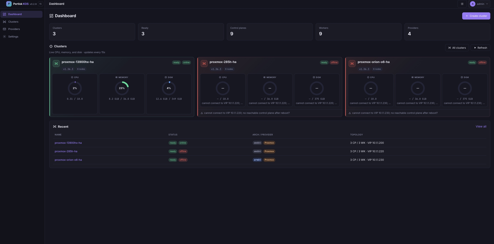

# Pertisk KOS

Immutable, API-only Kubernetes node OS, plus an optional management plane for provisioning HA clusters.

- **Node OS** — Rust `pertiskd` as PID 1, gRPC management (`pertiskctl`), containerd + kubelet; no SSH in production images
- **Serial dashboard** — fullscreen status TUI on Proxmox / ESXi / AHV / Pertisk VMs Serial
- **Management plane** — `pertisk-mgmt` (API + React UI) creates and operates clusters on **Proxmox**, standalone **ESXi**, **Nutanix AHV**, and **Pertisk VMs**
- **Terraform** — `terraform-provider-pertisk` for the same mgmt API (register hypervisors, create / scale / upgrade / destroy)
- **Cluster API** — CAPx (planned): Kubebuilder controllers for `Cluster` / `Machine` / `MachineDeployment`

Architecture and phases: [DESIGN.md](./DESIGN.md). **Production install (Proxmox / Nutanix / vSphere / Pertisk VMs, SSH matrix):** [docs/DEPLOY.md](./docs/DEPLOY.md). Secure Boot / TPM lab: [docs/SECURE_BOOT.md](./docs/SECURE_BOOT.md). Kernel cmdline (dashboard knobs): [docs/KERNEL.md](./docs/KERNEL.md).



## Status

**P5 (productize) — done for lab / HA.**

| Area | Progress |
|------|----------|
| Node OS + A/B + hardening CI | done |
| Serial console dashboard (dual-stack, themes) | done |
| HA bootstrap (stacked etcd + kube-vip) | done |
| CNI lab (Cilium / Calico / Flannel) | done |
| Mgmt UI (Proxmox + ESXi + Nutanix AHV + Pertisk VMs) | done |
| Metrics mTLS (`:50001` with API PEMs) | done |
| UKI / OVMF enroll (`make enroll-ovmf`) | done |
| TPM PCR Attest (sysfs / `pertiskctl attest`) | done (lab) |
| BusyBox-free DHCPv4 (builtin only) | done — T1 renew / T2 rebind |
| util-linux mount/umount + iproute2 ip | done |
| CRI introspection (`pertiskctl containers`) | done (lab) — kind / pod / ns labels |
| Net / disk inspect (`pertiskctl interfaces` / `disks`) | done (lab) |
| TPM2 Quote (`pertiskctl quote --verify`) | done (lab) |
| EK cert + manufacturer CA chain | done (lab) — `PERTISK_TPM_EK_CAS` / `--ek-cas` |
| Mgmt Quote trust store (AK enroll / verify) | done (lab) |
| etcd snapshot / restore / recover (`pertiskctl etcd …`) | done (lab) |
| Terraform provider (`pertisk_cluster` / `pertisk_node`) | done |
| Observability compose (Prometheus / Grafana / Loki) | done |
| Cluster API provider (CAPx) | planned |

---

## Features

### Platform / node OS

- Immutable node OS: same cloud image for `controlplane` and `worker` (role from machine config)
- `pertiskd` PID 1: GPT / STATE / EPHEMERAL disks, DHCP or static net, containerd, kubelet, signed A/B updates, serial console dashboard
- Multi-arch **amd64** / **arm64** (initramfs + cloud qcow2/raw)
- A/B OS updates with Ed25519-signed bundles (`pertisk-update` / `pertisk-sign`)
- In-process DHCPv4 only (no BusyBox `udhcpc`); T1 renew + T2 rebind maintainer
- util-linux `mount`/`umount` + iproute2 `ip` (no BusyBox applets)
- UKI / Secure Boot lab path (`make uki`, `make enroll-ovmf`, `PERTISK_TPM=1`) — see [docs/SECURE_BOOT.md](./docs/SECURE_BOOT.md)
- Guest extensions: **nfs-client**, **qemu-guest-agent**
- Machine config `v1alpha1`: network, install disk, cluster endpoint/token/CA, kubelet `maxPods`, `machine.dashboard`
- Observability: gRPC mTLS **:50000**, Prometheus **:50001** (mTLS when TLS PEMs set; optional bearer), optional Loki push, `pertiskctl logs` / `attest` / `quote` / `etcd` / `containers` / `interfaces` / `disks` / `reset`
- Soft reset: `pertiskctl reset --force` (clears STATE + runtime, keeps GPT)
- Hardening checklist + `make check-hardening` — [docs/HARDENING.md](./docs/HARDENING.md)

### Serial console dashboard

Fullscreen status TUI on the Serial / xterm.js console (Proxmox / ESXi). Enabled by default; disable with `pertisk.dashboard.disabled=1`, `PERTISK_DASHBOARD_DISABLED=1`, or `--no-dashboard`.

| Piece | What you get |
|-------|----------------|
| **Layout** | Header (hostname / READY / CPU·RAM·load / uptime) → summary → scrolling logs → footer |
| **Summary (≥80 cols)** | `PERTISK` \| `KUBERNETES` side-by-side, then full-width **NETWORK** (so dual-stack IPv6 is not clipped) |
| **Summary (&lt;80 cols)** | Compact single `SYSTEM` panel |
| **PERTISK** | Machine type, READY, containerd / kubelet status + PIDs |
| **KUBERNETES** | Version, API endpoint, CNI, dual-stack POD / SVC CIDRs |
| **NETWORK** | Primary iface IPv4 + global IPv6 (GUA + ULA; link-local `fe80::` hidden), one address per line |
| **Logs** | Word-wrapped ring buffer; horizontal rules only (no vertical `\|` borders) |
| **Borders** | Default `line`: continuous ASCII `-` (Serial-safe). Optional Unicode styles when UTF-8 works |
| **Themes** | `catppuccin` (default), `dracula`, `nord`, `gruvbox`, `tokyo-night`, `solarized`, `cyberpunk`, `wild-cherry`, `mono` |
| **Sizing** | Prefer Serial / `dashboard.console` winsize (never VGA `tty0`); pin with `PERTISK_DASHBOARD_COLS` / `_ROWS` |
| **Config** | `machine.dashboard` YAML, kernel cmdline / env — see [docs/KERNEL.md](./docs/KERNEL.md) |

Local preview (same glyphs as deploy):

```bash
cargo run -p pertiskd --bin pertiskd -- --dashboard-preview
```

### Cluster lifecycle

- `pertiskctl gen config` — controlplane + worker YAML (HA multi-CP, dual-stack CIDRs, `maxPods`, `mgmt_url`)
- Bootstrap first CP (PKI + static pods: etcd, apiserver, controller-manager, scheduler)
- Join workers and **additional control planes** (stacked etcd)
- **HA**: `controlplanes > 1` → stacked etcd + **kube-vip** VIP (IPv4 ARP and/or IPv6 ND)
- Post-bootstrap finalize: bootstrap-token Secret, node RBAC, control-plane labels/taints, CoreDNS + metrics-server
- Mgmt UI / lab scripts: create, add nodes, bulk reboot/delete, hardware resize (grow EPHEMERAL), delete cluster
- Rolling Kubernetes upgrade (drain → bump version → Ready → uncordon; CPs then workers)
- Download / show / copy cluster kubeconfig
- Soft reset / reboot / shutdown via Machine API

### Networking

| Mode / CNI | Notes |
|------------|--------|
| IPv4 / IPv6 / **dual-stack** | Pod + service CIDRs; optional VIP6; dashboard shows both families |
| Built-in `cluster.cni: bridge` | Unique `podCidr` — single-node / lab |
| **Cilium** (default in lab-up) | `kubeProxyReplacement`; guest needs shared bpffs |
| Calico / Flannel | Via lab-up or `examples/cni/` with `cni: none` |
| kube-vip | Static pod on CPs (needs guest `af_packet`) |

Optional addons: CoreDNS, metrics-server, kubernetes-reflector, NFS provisioner — see [examples/addons/](./examples/addons/).

### Observability

Host metrics come from **`pertiskd` itself** (`:50001/metrics`) — no node_exporter on the guest. Logs stay on the Machine API and can be pushed to Loki.

| Piece | What you get |
|-------|----------------|
| **Metrics** | CPU, load, memory, disk I/O, filesystem, network, uptime, boot/health |
| **Scrape** | Prometheus file_sd from mgmt inventory (`sync-file-sd.sh`) |
| **Logs** | `pertiskctl logs` (incl. `-f`) + optional Loki / Alloy push (`lokiUrl`) |
| **Grafana** | Pertisk node + logs dashboards (provisioned JSON) |
| **Edge** | Alloy example: scrape / receive → remote_write Mimir + Loki |

Compose stack (Prometheus, Grafana, Loki, Alloy, Pushgateway): [examples/observability/](./examples/observability/).

### Management UI

Single-port API + UI (`pertisk-mgmt`). Details: [docs/MGMT.md](./docs/MGMT.md).

| Area | Capabilities |
|------|----------------|
| **Auth** | Local, Auth0, or both; roles `admin` \| `operator` \| `viewer` |
| **Dashboard** | Cluster counts, online/offline reachability, CPU / memory / disk gauges |
| **Providers** | Proxmox (API token), **vSphere ESXi** (SOAP `/sdk`), **Nutanix AHV** (Prism Element REST); test probe |
| **Create cluster** | Provider, CP/worker counts, arch, CNI, K8s version, max pods, VIP / dual-stack, VMID + live conflict checks, HW sizes |
| **Cluster detail** | Overview, Nodes, **K8s** workloads, **Shell** (mgmt-host PTY + kubeconfig), Config, Upgrade, Jobs |
| **Node detail** | Inventory, live health, metrics charts, log tail |
| **Machines** | Cross-cluster node inventory (Phase D) |
| **Templates** | Reusable machine-config blueprints (Phase D) |
| **Audit** | Management action log (Phase D) |
| **Adopt / join** | Register existing/bare-metal nodes; join-token snapshots (Phase D2) |
| **Settings** | Session, listen/public URL, JWT TTL, paths, auth mode |
| **Events** | SSE (`GET /api/events`) for job / cluster status |

### Terraform provider

IaC for the same mgmt API: register Proxmox / vSphere / Nutanix, create HA/dual-stack clusters, size CP/worker VMs, scale with `pertisk_node`, upgrade via `k8s_version`.

→ [tools/terraform-provider-pertisk/README.md](./tools/terraform-provider-pertisk/README.md) (features, examples, docs, `TF_ACC` tests)

### Cluster API provider (CAPx) — planned

[Cluster API](https://cluster-api.sigs.k8s.io/) is the Kubernetes standard for declarative cluster lifecycle. A Pertisk provider (CAPx) would put Pertisk in that ecosystem next to CAPA / CAPV / CAPM3: GitOps `Cluster` objects, `clusterctl`, multi-cluster managers.

| Controller | Role |
|------------|------|
| **Cluster** | Desired cluster: endpoint, Kubernetes version, CNI, HA control plane |
| **Machine** | One node: create/delete the VM, wait until `pertiskd` is Ready |
| **MachineDeployment** | Scale workers and rolling upgrades |
| **Infrastructure** | Proxmox / ESXi / Nutanix APIs (or reuse `pertisk-mgmt`) |
| **Bootstrap** | Pertisk OS install + machine config + Kubernetes join |

**Language:** Go (Kubebuilder, controller-runtime) — the CAPI contract. Does not replace the node OS or `pertisk-mgmt`; v1 can call mgmt so hypervisor logic stays in one place.

### Providers

| Provider | Status | Docs |
|----------|--------|------|
| Proxmox VE | Supported (API token; optional SSH for arm64 create) | [docs/PROXMOX.md](./docs/PROXMOX.md) |
| VMware ESXi (standalone) | Supported (qcow2→VMDK) — not vCenter | [docs/VSPHERE.md](./docs/VSPHERE.md) |
| Nutanix AHV (Prism Element) | Supported (qcow2 URL import + UEFI VM) | [docs/NUTANIX.md](./docs/NUTANIX.md) |
| Pertisk VMs (pertiskd) | Supported (qcow2 stream import + QEMU UEFI) | [docs/PERTISK_VMS.md](./docs/PERTISK_VMS.md) |
| QEMU / bare metal EFI | Supported | [image/README.md](./image/README.md) |
| AWS / GCP / Azure | Outlined only (**paused**) | [image/cloud/README.md](./image/cloud/README.md) |

---

## Architecture

```
pertiskctl / mgmt UI / Terraform ──gRPC mTLS / HTTPS──► pertiskd (PID 1) ──► containerd + kubelet
pertisk-mgmt ──HTTPS──► Proxmox API / ESXi SOAP / Prism Element / pertisk-vms `/v1`
             └── runs lab-up jobs; stores kubeconfigs + inventory
CAPx (planned) ──CAPI Cluster/Machine──► pertisk-mgmt / hypervisor APIs
```

| Crate | Role |
|-------|------|
| `pertiskd` | PID 1 / node supervisor + Serial dashboard |
| `pertisk-api` / `pertisk-proto` | gRPC management API |
| `pertisk-config` | Machine config schema |
| `pertisk-disk` / `pertisk-net` | Volumes + host networking |
| `pertisk-runtime` / `pertisk-kubelet` | containerd + kubelet |
| `pertisk-update` | A/B update / sign |
| `pertisk-bootstrap` | PKI, static pods, join, gen config, kube-vip, addons |
| `pertiskctl` | Node management CLI |
| `pertisk-mgmt` | Cluster mgmt API + embedded React UI |

---

## Quick starts

### 1. Management UI (local)

```bash
export MGMT_ADMIN_USER=admin
export MGMT_ADMIN_PASSWORD=admin
export MGMT_SECRET_KEY=$(openssl rand -hex 32)

make mgmt
./out/bin/pertisk-mgmt --listen 0.0.0.0:8080 --db ./data/mgmt.db
# open http://127.0.0.1:8080
```

Dev (UI hot reload):

```bash
MGMT_ADMIN_PASSWORD=admin cargo run -p pertisk-mgmt -- --listen 127.0.0.1:8080
cd web/mgmt-ui && npm run dev   # :5173 proxies /api → :8080
```

### 2. Deploy mgmt RPM + cloud images

```bash
./scripts/deploy-mgmt-lab.sh --mgmt user@mgmt.example.com --version 0.3.0
```

Production steps (Proxmox / Nutanix / ESXi / Pertisk VMs) and **when SSH is required:** [docs/DEPLOY.md](./docs/DEPLOY.md). RPM env notes: [docs/MGMT.md](./docs/MGMT.md#rpm-deploy-linuxamd64).

### 3. CLI cluster (Proxmox lab-up)

```bash
make cloud ARCH=amd64
make pertiskctl
export PROXMOX_SSH=root@<pve>

# Example HA: 3 CP + 3 workers, Cilium, VIP
./scripts/proxmox-lab-up.sh \
  --controlplanes 3 --workers 3 \
  --vip <free-ip> --cni cilium

# ESXi: ./scripts/vsphere-lab-up.sh …
# AHV:  ./scripts/nutanix-lab-up.sh …
```

Manual cluster flow (`gen config` → apply → bootstrap → join): [docs/PROXMOX.md](./docs/PROXMOX.md). Nutanix: [docs/NUTANIX.md](./docs/NUTANIX.md). Pertisk VMs: [docs/PERTISK_VMS.md](./docs/PERTISK_VMS.md).

### 4. Build node OS images

```bash
make help
make build VERSION=0.2.0 ARCH=amd64 EMBED_BOOT=1 EMBED_RUNTIME=1
make build-all VERSION=0.2.0            # amd64 + arm64
make cloud VERSION=0.2.0 ARCH=amd64     # golden disk → out/pertisk-cloud-*.qcow2
make os-trust                           # Ed25519 keys → out/secrets/os-trust.{sk,pk}
make os-bundle VERSION=0.2.0 ARCH=amd64 # signed A/B OS zip → out/os-bundle-*-v*.zip
make uki ARCH=amd64                     # Unified Kernel Image
make pertiskctl                         # → out/bin/pertiskctl
make mgmt / make mgmt-pkg               # UI+API binary / DEB+RPM + pertiskctl (amd64+arm64)
```

Artifacts: `out/initramfs-<arch>.cpio.gz` (or `-debug`), versioned copies, `out/uki/`, `out/pkg/` (mgmt + pertiskctl DEB/RPM/binaries, release qcow2 + os-bundle), `out/os-bundle-<arch>-v<VERSION>.zip`. GitHub Releases on tag `X.Y.Z` attach those guest files when CI is configured.

`make os-bundle` is the in-place OS A/B path (kernel + initramfs, Kubernetes unchanged). Upload the zip on **OS packages**. Recreating VMs from a new qcow2 is a reinstall: upload `pertisk-cloud-{amd64,arm64}.qcow2` on **Images**, then Create Cluster. pertisk-mgmt does not compile guest images.

### 5. Preview Serial dashboard locally

```bash
cargo run -p pertiskd --bin pertiskd -- --dashboard-preview
```

---

## Observability

```bash
# Plaintext (lab default when TLS unset)
curl -s http://127.0.0.1:50001/metrics
curl -s http://127.0.0.1:50001/metrics | grep '^pertisk_cpu\|^pertisk_memory\|^pertisk_network\|^pertisk_disk'

# mTLS (same PEMs as the management API; enabled whenever --tls-* is set)
curl -s --cacert out/mtls/ca.crt \
  --cert out/mtls/client.crt --key out/mtls/client.key \
  https://127.0.0.1:50001/metrics
# Optional bearer still applies: --metrics-token / PERTISK_METRICS_TOKEN / STATE secrets/metrics.token

# Optional Loki push (same log sources as pertiskctl logs)
# PERTISK_LOKI_URL=http://<alloy>:3500/loki/api/v1/push

./out/bin/pertiskctl -e 127.0.0.1:50000 logs dmesg -n 50
./out/bin/pertiskctl -e 127.0.0.1:50000 logs pertiskd
./out/bin/pertiskctl -e 127.0.0.1:50000 containers # containerd k8s.io via ctr (+ CRI labels)
./out/bin/pertiskctl -e 127.0.0.1:50000 interfaces
./out/bin/pertiskctl -e 127.0.0.1:50000 disks
./out/bin/pertiskctl -e 127.0.0.1:50000 logs container:<id> -n 200  # CRI app logs via /var/log/pods
./out/bin/pertiskctl -e 127.0.0.1:50000 attest      # TPM PCRs when present
./out/bin/pertiskctl -e 127.0.0.1:50000 quote --verify  # TPM2 Quote + local verify
# Optional EK manufacturer chain: --ek-cas /path/to/cas  (or PERTISK_TPM_EK_CAS on the node)
./out/bin/pertiskctl -e 127.0.0.1:50000 etcd snapshot
./out/bin/pertiskctl -e 127.0.0.1:50000 etcd recover --force-new-cluster --force  # HA, no leader
```

## mTLS + signed upgrade smoke

```bash
./scripts/gen-mtls-certs.sh
mkdir -p /tmp/pertisk-state/secrets
cargo run -p pertisk-update --bin pertisk-sign -- keygen \
  --secret /tmp/pertisk-state/secrets/os-trust.sk \
  --public /tmp/pertisk-state/secrets/os-trust.pk

mkdir -p /tmp/bundle && echo k >/tmp/bundle/kernel && echo i >/tmp/bundle/initramfs
cargo run -p pertisk-update --bin pertisk-sign -- sign \
  --bundle /tmp/bundle --version 0.2.0 \
  --secret /tmp/pertisk-state/secrets/os-trust.sk

cp examples/worker.yaml /tmp/pertisk-state/config.yaml
cargo run -p pertiskd -- --state-dir /tmp/pertisk-state --force-init --skip-runtime \
  --api-listen 127.0.0.1:50000 \
  --metrics-listen 127.0.0.1:50001 \
  --tls-ca out/mtls/ca.crt --tls-cert out/mtls/server.crt --tls-key out/mtls/server.key \
  --trust-key /tmp/pertisk-state/secrets/os-trust.pk
```

## QEMU / UEFI install smoke

```bash
PERTISK_EMBED_BOOT=1 ./image/build-initramfs.sh
./image/create-disk.sh
./image/run-qemu-disk.sh          # first boot: GPT install + ESP
./image/run-qemu-uefi.sh          # boot from disk (OVMF)
# PERTISK_TPM=1 ./image/run-qemu-uefi.sh   # soft-TPM (swtpm) for PCR Attest lab
```

## Compatibility / CI / SBOM

- Matrix (K8s, containerd, CNI, arch): [docs/COMPATIBILITY.md](./docs/COMPATIBILITY.md)
- Hardening: [docs/HARDENING.md](./docs/HARDENING.md) — `make check-hardening`
- SBOM: `./scripts/generate-sbom.sh` → `out/sbom/`
- CI: fmt, clippy, tests, SBOM, amd64 initramfs build

---

## Documentation

| Doc | Topic |
|-----|--------|
| [DESIGN.md](./DESIGN.md) | Architecture, phases, security model |
| [docs/MGMT.md](./docs/MGMT.md) | Management UI/API, auth, create, RPM |
| [docs/KERNEL.md](./docs/KERNEL.md) | Kernel cmdline (dashboard, defaults, deferred) |
| [docs/PROXMOX.md](./docs/PROXMOX.md) | Proxmox token, upload, cluster bootstrap |
| [docs/VSPHERE.md](./docs/VSPHERE.md) | ESXi provider |
| [docs/NUTANIX.md](./docs/NUTANIX.md) | Nutanix AHV (Prism Element) provider |
| [docs/PERTISK_VMS.md](./docs/PERTISK_VMS.md) | Pertisk VMs (pertiskd) provider |
| [docs/COMPATIBILITY.md](./docs/COMPATIBILITY.md) | Platforms, runtime pins, CNI |
| [docs/OS.md](./docs/OS.md) | Disk layout, A/B upgrade, process tree |
| [docs/MIGRATE.md](./docs/MIGRATE.md) | Migrate to Pertisk (online manifests / etcd DR) |
| [docs/PACKAGE.md](./docs/PACKAGE.md) | Upstream release links / kernel pins |
| [docs/HARDENING.md](./docs/HARDENING.md) | CIS-ish worker checklist |
| [docs/SECURE_BOOT.md](./docs/SECURE_BOOT.md) | UKI + OVMF enroll + TPM PCR Attest lab |
| [image/README.md](./image/README.md) | Initramfs / QEMU |
| [image/cloud/README.md](./image/cloud/README.md) | Cloud upload outlines |
| [image/extensions/README.md](./image/extensions/README.md) | nfs-client, qemu-ga |
| [tools/terraform-provider-pertisk/README.md](./tools/terraform-provider-pertisk/README.md) | Terraform: cluster create / HA / dual-stack / sizing / scale |
| [examples/cni/README.md](./examples/cni/README.md) | Cilium / Calico / Flannel |
| [examples/addons/README.md](./examples/addons/README.md) | CoreDNS, metrics-server, reflector, NFS |
| [examples/observability/README.md](./examples/observability/README.md) | Host metrics scrape, Grafana/Loki compose, Alloy → Mimir |

## Next

- **CAPx** — Cluster API provider (Go / Kubebuilder): `Cluster` / `Machine` / `MachineDeployment` → Pertisk bootstrap on Proxmox / ESXi / Nutanix
- **Phase D3** — multi-tenant orgs / SaaS packaging (later)
- AWS / GCP / Azure providers — paused (outlines only)
